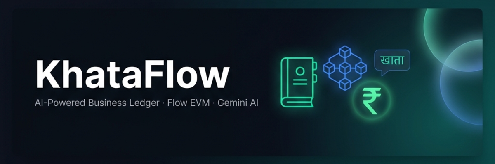
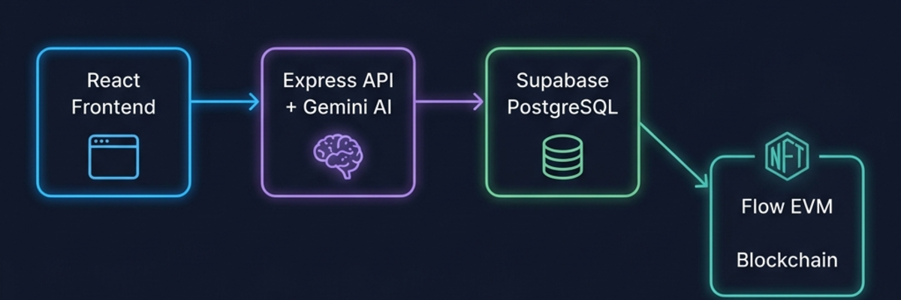

<div align="center">

# 🧾 KhataFlow

### AI-Powered Business Ledger on Flow EVM — Built for India's Kirana Economy



[](https://developers.flow.com/evm/about)
[](https://ai.google.dev/)
[](https://supabase.com)
[](https://react.dev)
[](https://typescriptlang.org)
[](./LICENSE)

> **Talk to your business in Hindi, English, or Hinglish. KhataFlow records it, tracks it — and puts it on the blockchain.**

</div>

---

## 📖 What is KhataFlow?

India has over **60 million kirana stores** — small neighborhood shops that run entirely on trust and handwritten ledgers called *"khata"*. These shopkeepers extend credit to their regular customers ("*udhaar*"), track who owes what, and manage inventory — all with a pen and paper (or at best, a simple app).

**KhataFlow changes that.**

It's a full-stack business management platform that combines:

- 🤖 **Conversational AI** (Google Gemini) — shopkeepers just *speak* or *type* in their natural language (Hindi / Hinglish / English)
- 🏦 **Real-time Ledger** — powered by Supabase (PostgreSQL) for instant data persistence
- 🔗 **Blockchain-Verified Invoices** — debts minted as NFTs on **Flow EVM Testnet** — transparent, immutable, and transferable
- 💸 **Installment Payment Schedules** — smart contracts automate payment milestones on-chain

KhataFlow bridges the gap between traditional Indian SMB accounting and the decentralized web3 economy.

---

## ✨ Key Features

### 🗣️ Natural Language Input (Hinglish-First AI)
Type or speak in any mix of Hindi + English. The Gemini-powered NLP engine understands:

| User says | System does |
|---|---|
| `"Ramesh ne 5kg aloo liya, 200 baaki hai"` | Records SALE of ₹200 to Ramesh Kumar |
| `"Priya ne 500 de diye"` | Marks ₹500 PAYMENT received |
| `"Chawal ka stock 100kg add karo"` | Updates inventory with 100 kg rice |
| `"Suresh ka khata dikhao"` | Fetches Suresh's outstanding balance & transactions |

### 📒 Live Ledger Dashboard
- View all clients and their outstanding balances in real time
- Track individual transaction histories (sales + payments)
- Dashboard summary: total revenue, pending dues, active NFTs
- Recent activity feed: payments, NFT mints, low-stock alerts

### 📦 Inventory Management
- Add/update items with quantity and unit
- Automatic low-stock alerts below configurable threshold
- Seamlessly update stock via natural conversation

### 🧾 Blockchain Invoices (NFTs)
- Convert any invoice into an **ERC-721 NFT** on Flow EVM
- Debt amount stored in *paise* (smallest INR unit) for precision
- Each NFT records: client name, business ID, amount, due date, invoice reference
- On-chain `settleDebt()` marks the NFT as paid — immutable audit trail
- View live NFT status via **Flow EVM Testnet Explorer**

### 📅 Installment Payment Scheduling
- Create multi-installment payment plans for large debts
- `KhataFlowPayments` contract tracks: installments paid, next due date, completion
- Frequency configurable from hourly to monthly
- On-chain events fired for every recorded payment

---

## 🏗️ Architecture Overview



> **React Frontend** → **Express API + Gemini AI** → **Supabase (PostgreSQL)** + **Flow EVM Blockchain**

### Technology Stack

| Layer | Technology | Purpose |
|---|---|---|
| **Frontend** | React 18 + React Router v7 | SPA with multi-page navigation |
| **UI** | Radix UI + TailwindCSS + shadcn/ui | Accessible, consistent component system |
| **State** | Zustand + TanStack React Query | Global state + server data caching |
| **Backend** | Express.js + TypeScript | REST API server |
| **AI/NLP** | Google Gemini 2.0 Flash | Natural language business command parsing |
| **Database** | Supabase (PostgreSQL) | Persistent ledger, clients, transactions |
| **Blockchain** | ethers.js v6 + Flow EVM | NFT minting, on-chain debt records |
| **Smart Contracts** | Solidity ^0.8.20 + Hardhat | ERC-721 NFT + Payment scheduling |
| **Charts** | Recharts | Financial data visualizations |

---

## 📁 Project Structure

```
KhataFlow/
├── 📂 backend/              # Express.js TypeScript API
│   ├── src/
│   │   ├── routes/         # API route handlers
│   │   │   ├── chat.ts     # AI command processing
│   │   │   ├── ledger.ts   # Client & transaction queries
│   │   │   ├── inventory.ts # Inventory management
│   │   │   ├── invoices.ts # Invoice CRUD
│   │   │   └── chain.ts    # Blockchain interactions
│   │   ├── services/
│   │   │   ├── gemini.ts   # Gemini AI service
│   │   │   ├── blockchain.ts # ethers.js + Flow EVM
│   │   │   └── supabase.ts # Supabase client
│   │   ├── middleware/
│   │   │   └── businessId.ts # Business ID extraction
│   │   └── index.ts        # Express app entrypoint
│   ├── schema.sql          # PostgreSQL schema + seed data
│   └── package.json
│
├── 📂 frontend/             # React 18 SPA
│   ├── src/
│   │   ├── pages/          # Top-level route pages
│   │   │   ├── ChatPage.jsx
│   │   │   ├── LedgerPage.jsx
│   │   │   ├── InventoryPage.jsx
│   │   │   ├── InvoicesPage.jsx
│   │   │   └── ChainPage.jsx
│   │   ├── components/     # Reusable UI components
│   │   ├── hooks/          # Custom React hooks
│   │   ├── lib/            # Utilities and helpers
│   │   └── store/          # Zustand state management
│   └── package.json
│
├── 📂 contracts/            # Hardhat smart contracts
│   ├── contracts/
│   │   ├── KhataFlowNFT.sol       # ERC-721 Debt NFT
│   │   └── KhataFlowPayments.sol  # Installment scheduler
│   ├── scripts/            # Deployment scripts
│   ├── test/               # Contract tests
│   ├── deployed-addresses.json    # Live deployment info
│   └── hardhat.config.ts
│
├── SETUP_GUIDE.md
├── QUICK_REFERENCE.md
└── README.md               ← You are here
```

---

## 🚀 Quick Start

### Prerequisites

- **Node.js** v18+
- **Yarn** v1.22+
- **MetaMask** (with Flow EVM Testnet configured)
- A **Supabase** project
- A **Google Gemini** API key

### 1. Clone the Repository

```bash
git clone https://github.com/your-username/KhataFlow.git
cd KhataFlow
```

### 2. Set Up the Database (Supabase)

1. Create a free project at [supabase.com](https://supabase.com)
2. Go to **SQL Editor** in your Supabase dashboard
3. Copy-paste `backend/schema.sql` and click **Run**

### 3. Configure the Backend

```bash
cd backend
cp .env.example .env
```

Edit `.env`:

```env
SUPABASE_URL=https://your-project.supabase.co
SUPABASE_SERVICE_ROLE_KEY=your_service_role_key
GEMINI_API_KEY=your_gemini_api_key
FLOW_EVM_RPC=https://testnet.evm.nodes.onflow.org
NFT_CONTRACT_ADDRESS=0x6fa658e00103EFD1Cf9dFbD0f0E71dFAA44979ad
PAYMENTS_CONTRACT_ADDRESS=0xeA9d2e308394555B914dFd962E8C97DCA2bEF73a
PORT=8001
```

```bash
yarn install
yarn dev
```

Backend starts at `http://localhost:8001`

### 4. Configure the Frontend

```bash
cd ../frontend
cp .env.example .env
```

Edit `.env`:

```env
REACT_APP_BACKEND_URL=http://localhost:8001
REACT_APP_NFT_CONTRACT_ADDRESS=0x6fa658e00103EFD1Cf9dFbD0f0E71dFAA44979ad
REACT_APP_PAYMENTS_CONTRACT_ADDRESS=0xeA9d2e308394555B914dFd962E8C97DCA2bEF73a
REACT_APP_FLOW_CHAIN_ID=545
```

```bash
yarn install
yarn start
```

Frontend opens at `http://localhost:3000`

---

## 🔌 API Reference

All endpoints are prefixed with `/api`. Backend defaults to `http://localhost:8001`.

### Health Check

```
GET /health
```

### 💬 Chat (AI Command Processing)

```
POST /api/chat
Content-Type: application/json

{
  "message": "Ramesh ne aloo 5kg liya 200 baaki",
  "conversationHistory": []
}
```

**Response:**
```json
{
  "success": true,
  "action": {
    "intent": "ADD_SALE",
    "clientName": "Ramesh",
    "items": [{ "name": "aloo", "qty": 5, "unit": "kg", "price": 40 }],
    "totalAmount": 200,
    "response": "Transaction recorded! Ramesh ka khata update ho gaya."
  },
  "dbResult": { "client": {}, "transaction": {} }
}
```

**Supported intents:** `ADD_SALE` | `MARK_PAID` | `UPDATE_STOCK` | `QUERY_LEDGER` | `UNKNOWN`

### 📒 Ledger

| Method | Route | Description |
|---|---|---|
| `GET` | `/api/ledger/clients` | All clients with balances |
| `GET` | `/api/ledger/clients/:clientId` | Single client with transaction history |
| `GET` | `/api/ledger/summary` | Dashboard totals (revenue, outstanding, NFT count) |
| `GET` | `/api/ledger/activity` | Recent activity feed (last 10 events) |

### 📦 Inventory

| Method | Route | Description |
|---|---|---|
| `GET` | `/api/inventory` | All inventory items (with low-stock flag) |
| `POST` | `/api/inventory` | Add or update an item |
| `PATCH` | `/api/inventory/:itemId` | Update quantity only |

### 🧾 Invoices

| Method | Route | Description |
|---|---|---|
| `GET` | `/api/invoices` | All invoices (filter by `?status=MINTED`) |
| `POST` | `/api/invoices` | Create a new invoice |
| `GET` | `/api/invoices/:invoiceId` | Single invoice details |
| `PATCH` | `/api/invoices/:invoiceId` | Update status, NFT token ID, tx hash |

### ⛓️ Blockchain

| Method | Route | Description |
|---|---|---|
| `POST` | `/api/chain/record-mint` | Verify & record an NFT mint transaction |
| `GET` | `/api/chain/token/:tokenId` | Get NFT + on-chain debt record |
| `GET` | `/api/chain/tx/:txHash` | Get transaction status from chain |

---

## ⛓️ Smart Contracts

Deployed on **Flow EVM Testnet** (Chain ID: `545`).

| Contract | Address | Explorer |
|---|---|---|
| `KhataFlowNFT` | `0x6fa658e00103EFD1Cf9dFbD0f0E71dFAA44979ad` | [View on FlowScan](https://evm-testnet.flowscan.io/address/0x6fa658e00103EFD1Cf9dFbD0f0E71dFAA44979ad) |
| `KhataFlowPayments` | `0xeA9d2e308394555B914dFd962E8C97DCA2bEF73a` | [View on FlowScan](https://evm-testnet.flowscan.io/address/0xeA9d2e308394555B914dFd962E8C97DCA2bEF73a) |

### KhataFlowNFT (ERC-721)

Each minted NFT encodes a debt record permanently on-chain:

```solidity
struct DebtRecord {
    string businessId;      // Identifies the store
    string clientName;      // Who owes the money
    uint256 amountInPaise;  // Debt in paise (1 INR = 100 paise)
    uint256 dueDateUnix;    // When it's due
    string invoiceRef;      // Link to off-chain invoice ID
    bool settled;           // Has the debt been repaid?
    uint256 mintedAt;       // When this NFT was created
}
```

**Key methods:**

| Function | Description |
|---|---|
| `mintDebt(to, businessId, clientName, amount, dueDate, invoiceRef)` | Mint a new debt NFT |
| `settleDebt(tokenId)` | Mark a debt as settled |
| `getDebtRecord(tokenId)` | Read the full debt record |
| `isOverdue(tokenId)` | Check if a debt has passed its due date |
| `getBusinessTokens(businessId)` | All NFT token IDs for a business |

### KhataFlowPayments

Manages on-chain installment plans linked to debt NFTs:

```solidity
struct PaymentSchedule {
    uint256 debtTokenId;         // Which NFT this belongs to
    uint256 totalAmountPaise;    // Total to repay
    uint256 installmentPaise;    // Per-installment amount
    uint256 frequencySeconds;    // Time between payments
    uint256 nextDueUnix;         // When next payment is due
    uint256 paidInstallments;    // Installments completed
    uint256 totalInstallments;   // Total installments
    bool active;                 // Is the schedule still running?
    address businessWallet;      // Who manages this schedule
}
```

---

## 🗄️ Database Schema

KhataFlow uses **Supabase (PostgreSQL)** with the following tables:

```
businesses     → Store/owner registration (wallet address linkage)
clients        → Customers per business (with outstanding balance)
transactions   → SALE and PAYMENT records
inventory      → Stock items with low-stock threshold
invoices       → Invoice records (links to NFT token ID and tx hash)
chat_messages  → Optional conversation history storage
```

**Custom RPC functions:**
- `increment_client_balance(p_client_id, p_amount)` — atomically adds to outstanding balance
- `decrement_client_balance(p_client_id, p_amount)` — safely reduces balance (min 0)
- `reset_client_balance(p_client_id)` — marks all transactions PAID

---

## 🌍 Real-World Usage Scenarios

### Scenario 1: The Daily Kirana Run
*Ramesh owns a grocery store. At the end of the day, he types:*

> **"Sunita ne 3kg chawal, 2kg dal liya. Total 350 baaki hai"**

KhataFlow:
1. Gemini identifies intent: `ADD_SALE`, client: "Sunita", items parsed, amount ₹350
2. Supabase upserts the client, inserts a `SALE` transaction, increments outstanding
3. Dashboard updates instantly — Sunita now shows ₹350 in her ledger

---

### Scenario 2: Payment Day
*Sunita comes in and pays ₹200 cash:*

> **"Sunita ne 200 de diye"**

KhataFlow:
1. Intent: `MARK_PAID`, payment: ₹200
2. Inserts a `PAYMENT` transaction, decrements Sunita's balance to ₹150
3. Activity feed shows: *"Sunita paid ₹200"*

---

### Scenario 3: NFT-Backed Large Invoice
*A wholesale supplier sells ₹10,000 worth of goods to a merchant:*

1. Invoice created with due date 30 days out
2. Business owner clicks **"Mint as NFT"** from the invoices page
3. MetaMask prompts to call `mintDebt()` on `KhataFlowNFT`
4. NFT minted on Flow EVM — immutable proof of the debt
5. `record-mint` API verifies the transaction hash on-chain
6. Invoice status updates to `MINTED` with NFT token ID and tx hash

---

### Scenario 4: Installment Plan
*Merchant wants to repay in 5 monthly installments:*

1. Business calls `createSchedule()` on `KhataFlowPayments`
2. `installmentPaise = totalAmountPaise / 5`
3. `nextDueUnix` advances by `frequencySeconds` (e.g., 30 days) on each `recordInstallment()`
4. Smart contract emits `ScheduleCompleted` after the 5th installment

---

## 🔮 Future Scope

### Near-Term
- [ ] **Voice Input** — integrate Web Speech API for true voice-to-ledger recording
- [ ] **Authentication** — Supabase Auth + Row Level Security for multi-user stores
- [ ] **WhatsApp Bot** — Twilio / WhatsApp Business API for message-based commands
- [ ] **Multi-currency** — support USD, USDC stablecoin payments alongside INR

### Medium-Term
- [ ] **SMS Reminders** — auto-send payment reminders to clients via Twilio SMS
- [ ] **Credit Score** — on-chain payment history → generate a trust/credit score per client
- [ ] **PDF Invoices** — auto-generate printable invoice PDFs from minted NFTs
- [ ] **UPI Integration** — QR code generation and UPI deep links for payment collection

### Long-Term
- [ ] **DeFi Collateral** — use debt NFTs as collateral in lending protocols
- [ ] **ONDC Integration** — connect to India's Open Network for Digital Commerce
- [ ] **Supply Chain** — extend to multi-hop supply chain tracking with provenance NFTs
- [ ] **Mobile App** — React Native PWA for Android-first market (Jio phone support)
- [ ] **AI Analytics** — Gemini-powered business insights, seasonal demand forecasting

---

## 🤝 Contributing

Contributions are welcome! Please:

1. Fork the repository
2. Create a feature branch: `git checkout -b feature/amazing-feature`
3. Commit your changes: `git commit -m 'Add amazing feature'`
4. Push to the branch: `git push origin feature/amazing-feature`
5. Open a Pull Request

Please read our [Setup Guide](./SETUP_GUIDE.md) before contributing.

---

## 📄 License

This project is licensed under the **MIT License** — see the [LICENSE](./LICENSE) file for details.

---

## 🙏 Acknowledgments

- **Flow Blockchain** — for the developer-friendly EVM-compatible testnet
- **Google Gemini** — for powering multilingual NLP at the edge
- **Supabase** — for making PostgreSQL accessible and real-time
- **OpenZeppelin** — for battle-tested ERC-721 smart contract standards
- **Radix UI & shadcn/ui** — for the accessible, beautiful component system

---

<div align="center">

**Built with ❤️ for India's small business owners**

*KhataFlow — Jab business bolta hai, blockchain sunata hai.*<br>
*(When business speaks, blockchain listens.)*

</div>
